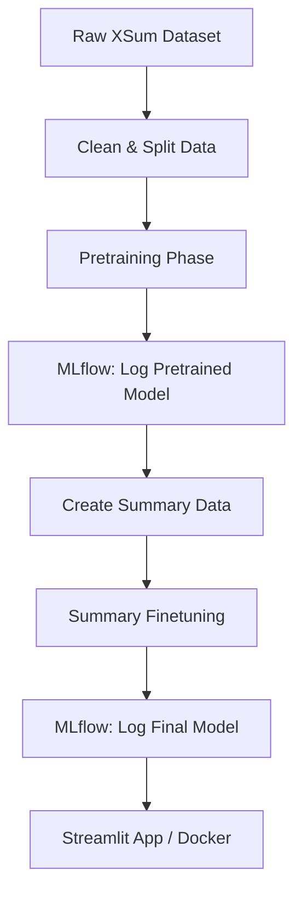

# System Design: Text Summarization GPT

## 1. Overview
This project implements a generative AI system for abstractive text summarization. It relies on a custom-built, autoregressive Language Model (decoder-only Transformer, similar to GPT-2) with approximately 125 million parameters.

## 2. Core Architecture

The architecture is a pure Transformer Decoder. It is trained in two distinct phases orchestrated entirely by **DVC**.

### Model Components
- **Tokenizer**: Byte-Pair Encoding (BPE) via HuggingFace Transformers.
- **Embedding Layer**: Maps tokens to dense vectors.
- **Positional Encoding**: Uses standard sine/cosine positional encodings to inject sequence order information.
- **Transformer Blocks**: A stack of multi-head masked self-attention layers followed by feed-forward networks (MLPs). The masking ensures the model cannot "look ahead" at future tokens.
- **Output Head**: A linear layer mapping the final hidden states to the vocabulary size to predict the next token.

### Pipeline Stages (DVC)

## 3. Training Strategy

### Phase 1: Unsupervised Pretraining
- **Objective**: Teach the model basic English grammar, syntax, and world knowledge.
- **Method**: Standard Causal Language Modeling. Given a sequence of text `[t_1, t_2, ..., t_n]`, the model learns to predict `t_{n+1}`.
- **Loss**: Cross-Entropy Loss.

### Phase 2: Supervised Fine-Tuning (Teacher Forcing)
- **Objective**: Teach the model to compress long articles into single sentences.
- **Method**: Teacher Forcing. The input to the model is the source article, appended with a special `[SEP]` token, followed by the target summary. During training, the model is fed the true previous token from the summary to predict the next token.
- **Loss**: Cross-Entropy Loss (calculated only on the summary portion of the sequence).

## 4. Design Choices & Trade-offs

* **Decoder-Only (GPT) vs Encoder-Decoder (BART/T5)**: While Encoder-Decoder architectures (like T5) are traditionally better at sequence-to-sequence tasks like summarization, this project intentionally builds a Decoder-only architecture to demonstrate the capability of autoregressive models (like GPT-3/4) to perform zero-shot and few-shot summarization without a dedicated encoder.
* **Teacher Forcing**: Instead of letting the model freely generate text during training (which is slow and highly unstable due to exposure bias), Teacher Forcing feeds the ground-truth sequence one token at a time. This massively stabilizes and accelerates convergence during the fine-tuning phase.
* **128 Context Length**: A relatively small context window was chosen due to hardware memory constraints for a 125M parameter model. The XSum dataset has highly concise summaries, making it feasible to fit both the core article and summary within 128 tokens.
* **Streamlit + Docker**: Ensures the model can be demonstrated interactively without requiring the user to run Jupyter Notebooks or understand PyTorch tensor shapes.
